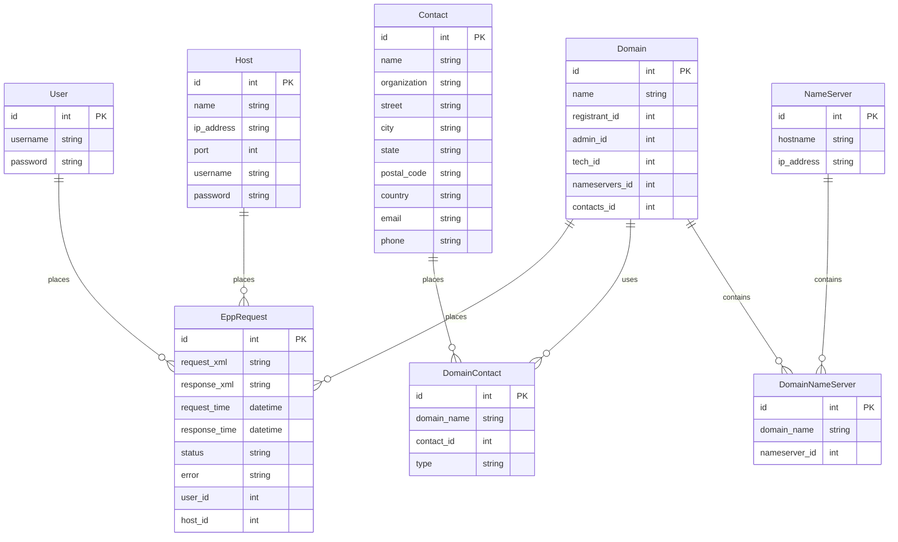

# ERD

```mermaid
erDiagram
    User {
      id int PK
      username string
      password string
    }

    Host {
      id int PK
      name string
      ip_address string
      port int
      username string
      password string
    }

    Domain {
      id int PK
      name string
      registrant_id int
      admin_id int
      tech_id int
      nameservers_id int
      contacts_id int
    }

    Contact {
      id int PK
      name string
      organization string
      street string
      city string
      state string
      postal_code string
      country string
      email string
      phone string
    }

    NameServer {
      id int PK
      hostname string
      ip_address string
    }

    DomainContact {
      id int PK
      domain_name string
      contact_id int
      type string
    }

    DomainNameServer {
      id int PK
      domain_name string
      nameserver_id int
    }

    EppRequest {
        id int PK
        request_xml string
        response_xml string
        request_time datetime
        response_time datetime
        status string
        error string
        user_id int
        host_id int
    }

    User ||--o{ EppRequest: places
    Host ||--o{ EppRequest: places
    Domain ||--o{ EppRequest: places
    Contact ||--o{ DomainContact: places
    Domain ||--o{ DomainContact: uses
    NameServer ||--o{ DomainNameServer: contains
    Domain ||--o{ DomainNameServer: contains

```
